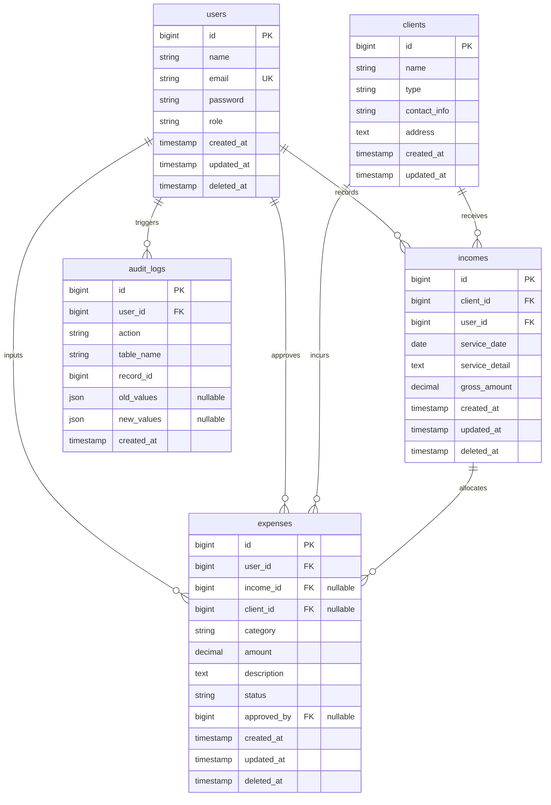

# Perancangan Basis Data & Diagram Hubungan Entitas (ERD) - J&J Sentral
**Kode Dokumen:** ERD-JNJ-SENTRAL-03  
**Versi:** 1.0.0  
**Tanggal:** 27 Juli 2026  
**Status:** Siap Ditinjau  
**Target Platform:** Database Relasional (MySQL/PostgreSQL) & Laravel 11.x  
**Pembuat:** Database Architect & Lead Backend Developer  

---

## 1. Pendahuluan
Dokumen ini menjelaskan struktur arsitektur basis data relasional untuk sistem **J&J Sentral**. Desain skema ini disusun berdasarkan kebutuhan fungsionalitas pencatatan keuangan dan operasional Rooterin (J&J Group). Dokumen ini mencakup diagram visual hubungan entitas (ERD), spesifikasi kamus data (data dictionary) setiap tabel, serta definisi relasi *Eloquent Model* di Laravel.

---

## 2. Visualisasi ERD (Mermaid.js)

Berikut adalah diagram relasi entitas menggunakan notasi visual kardinalitas Mermaid:



---

## 3. Kamus Data & Spesifikasi Tabel

### 3.1 Tabel `users`
Tabel ini menyimpan data akun pengguna dan perannya (RBAC). Tabel ini menggunakan fitur *Soft Deletes* agar akun yang dinonaktifkan (misalnya akun anak PKL yang masa magangnya habis) tetap mempertahankan integritas riwayat pencatatan transaksi masa lalu mereka.

| Nama Kolom | Tipe Data | Keterangan / Validasi |
| :--- | :--- | :--- |
| `id` | `BIGINT UNSIGNED` | Primary Key, Auto-increment. |
| `name` | `VARCHAR(255)` | Nama lengkap pengguna. |
| `email` | `VARCHAR(255)` | Unique Key, alamat surel unik untuk login. |
| `password` | `VARCHAR(255)` | Kata sandi ter-hash (Bcrypt). |
| `role` | `ENUM('owner', 'admin_ops', 'admin_web')` | Peran pengguna untuk otorisasi RBAC. |
| `created_at` | `TIMESTAMP` | Waktu pembuatan akun. |
| `updated_at` | `TIMESTAMP` | Waktu modifikasi akun terakhir. |
| `deleted_at` | `TIMESTAMP` | Nullable, waktu akun dinonaktifkan (Soft Delete). |

### 3.2 Tabel `clients`
Menyimpan informasi pelanggan Rooterin baik dari segmen korporasi/bisnis (B2B) maupun residensial.

| Nama Kolom | Tipe Data | Keterangan / Validasi |
| :--- | :--- | :--- |
| `id` | `BIGINT UNSIGNED` | Primary Key, Auto-increment. |
| `name` | `VARCHAR(255)` | Nama instansi, restoran, atau perorangan. |
| `type` | `ENUM('b2b', 'residential')` | Kategori segmentasi pasar. |
| `contact_info` | `VARCHAR(255)` | Nomor telepon/WhatsApp atau email kontak aktif. |
| `address` | `TEXT` | Alamat lengkap lokasi pengerjaan. |
| `created_at` | `TIMESTAMP` | Waktu data klien dimasukkan. |
| `updated_at` | `TIMESTAMP` | Waktu perubahan data klien. |

### 3.3 Tabel `incomes`
Menyimpan pencatatan pendapatan kotor dari proyek layanan *eco-plumbing*. Setiap baris pendapatan harus terhubung ke satu klien dan mencatat admin yang memasukkannya.

| Nama Kolom | Tipe Data | Keterangan / Validasi |
| :--- | :--- | :--- |
| `id` | `BIGINT UNSIGNED` | Primary Key, Auto-increment. |
| `client_id` | `BIGINT UNSIGNED` | Foreign Key, berelasi ke `clients.id`. |
| `user_id` | `BIGINT UNSIGNED` | Foreign Key, berelasi ke `users.id` (pencatat). |
| `service_date` | `DATE` | Tanggal dilaksanakannya layanan. |
| `service_detail` | `TEXT` | Deskripsi pekerjaan (misal: "Inspeksi CCTV pipa dapur"). |
| `gross_amount` | `DECIMAL(12,2)` | Nominal pendapatan kotor (Rupiah). |
| `created_at` | `TIMESTAMP` | Waktu data dicatat. |
| `updated_at` | `TIMESTAMP` | Waktu perubahan data. |
| `deleted_at` | `TIMESTAMP` | Nullable, kolom *Soft Delete*. |

### 3.4 Tabel `expenses`
Mencatat seluruh pengeluaran operasional dan overhead. Kolom relasi proyek (`income_id`) bersifat opsional (*nullable*), karena tidak semua pengeluaran diasosiasikan dengan proyek spesifik (misal: pengeluaran infrastruktur kantor bulanan).

| Nama Kolom | Tipe Data | Keterangan / Validasi |
| :--- | :--- | :--- |
| `id` | `BIGINT UNSIGNED` | Primary Key, Auto-increment. |
| `user_id` | `BIGINT UNSIGNED` | Foreign Key, berelasi ke `users.id` (staf yang menginput). |
| `income_id` | `BIGINT UNSIGNED` | Foreign Key, berelasi ke `incomes.id` (proyek terkait, nullable). |
| `client_id` | `BIGINT UNSIGNED` | Foreign Key, berelasi ke `clients.id` (klien terkait, nullable). |
| `category` | `ENUM` | Kategori (ads, entertain, infrastructure, fuel_parking, technician_wage, bonus_location, bonus_night, marketing_fee, welfare, unexpected). |
| `amount` | `DECIMAL(12,2)` | Nominal rupiah pengeluaran. |
| `description` | `TEXT` | Deskripsi rincian biaya (misal: "Upah harian Ardy & Abi"). |
| `status` | `ENUM('approved', 'pending', 'rejected')` | Status pengeluaran. Default `approved`, menjadi `pending` jika berupa *unexpected expense* atau *marketing fee* > 20%. |
| `approved_by` | `BIGINT UNSIGNED` | Foreign Key, berelasi ke `users.id` (Owner yang menyetujui, nullable). |
| `created_at` | `TIMESTAMP` | Waktu pembuatan data. |
| `updated_at` | `TIMESTAMP` | Waktu modifikasi data. |
| `deleted_at` | `TIMESTAMP` | Nullable, kolom *Soft Delete*. |

### 3.5 Tabel `audit_logs`
Mencatat riwayat perubahan data secara ketat. Tabel ini sangat penting untuk pelacakan audit dan verifikasi jika terdapat pengajuan revisi di luar batas waktu 24 jam.

| Nama Kolom | Tipe Data | Keterangan / Validasi |
| :--- | :--- | :--- |
| `id` | `BIGINT UNSIGNED` | Primary Key, Auto-increment. |
| `user_id` | `BIGINT UNSIGNED` | Foreign Key, berelasi ke `users.id` (aktor yang melakukan aksi). |
| `action` | `VARCHAR(50)` | Jenis aktivitas (`create`, `update`, `soft_delete`, `approve`). |
| `table_name` | `VARCHAR(100)` | Nama tabel target (misal: `expenses`, `incomes`). |
| `record_id` | `BIGINT UNSIGNED` | ID dari baris data yang dimodifikasi. |
| `old_values` | `JSON` | Nilai data sebelum diubah (nullable). |
| `new_values` | `JSON` | Nilai data sesudah diubah (nullable). |
| `created_at` | `TIMESTAMP` | Waktu log dicatat. |

---

## 4. Definisi Relasi Model Eloquent Laravel

Berikut adalah pemetaan implementasi relasi menggunakan sintaks pemrograman Laravel Eloquent:

### 4.1 Model `User`
```php
namespace App\Models;

use Illuminate\Database\Eloquent\Model;
use Illuminate\Database\Eloquent\SoftDeletes;

class User extends Model
{
    use SoftDeletes;

    // Transaksi pendapatan yang diinput oleh user ini
    public function incomes()
    {
        return $this->hasMany(Income::class, 'user_id');
    }

    // Transaksi pengeluaran yang diinput oleh user ini
    public function expenses()
    {
        return $this->hasMany(Expense::class, 'user_id');
    }

    // Pengeluaran yang disetujui oleh user ini (khusus Owner)
    public function approvedExpenses()
    {
        return $this->hasMany(Expense::class, 'approved_by');
    }

    // Log aktivitas yang dipicu oleh user ini
    public function auditLogs()
    {
        return $this->hasMany(AuditLog::class, 'user_id');
    }
}
```

### 4.2 Model `Client`
```php
namespace App\Models;

use Illuminate\Database\Eloquent\Model;

class Client extends Model
{
    // Seluruh riwayat pendapatan dari klien ini
    public function incomes()
    {
        return $this->hasMany(Income::class);
    }

    // Pengeluaran spesifik yang terjadi pada klien ini
    public function expenses()
    {
        return $this->hasMany(Expense::class);
    }
}
```

### 4.3 Model `Income`
```php
namespace App\Models;

use Illuminate\Database\Eloquent\Model;
use Illuminate\Database\Eloquent\SoftDeletes;

class Income extends Model
{
    use SoftDeletes;

    // Klien penerima jasa dari pendapatan ini
    public function client()
    {
        return $this->belongsTo(Client::class);
    }

    // Admin operasional pencatat data
    public function creator()
    {
        return $this->belongsTo(User::class, 'user_id');
    }

    // Pengeluaran yang dialokasikan langsung untuk proyek pendapatan ini
    public function expenses()
    {
        return $this->hasMany(Expense::class, 'income_id');
    }
}
```

### 4.4 Model `Expense`
```php
namespace App\Models;

use Illuminate\Database\Eloquent\Model;
use Illuminate\Database\Eloquent\SoftDeletes;

class Expense extends Model
{
    use SoftDeletes;

    // Admin operasional pencatat pengeluaran
    public function creator()
    {
        return $this->belongsTo(User::class, 'user_id');
    }

    // Proyek terkait (jika ada)
    public function income()
    {
        return $this->belongsTo(Income::class, 'income_id');
    }

    // Klien terkait (jika ada)
    public function client()
    {
        return $this->belongsTo(Client::class, 'client_id');
    }

    // Owner yang menyetujui transaksi ini (jika berstatus approved)
    public function approver()
    {
        return $this->belongsTo(User::class, 'approved_by');
    }
}
```

### 4.5 Model `AuditLog`
```php
namespace App\Models;

use Illuminate\Database\Eloquent\Model;

class AuditLog extends Model
{
    // Aktor yang memicu log audit ini
    public function user()
    {
        return $this->belongsTo(User::class);
    }
}
```
