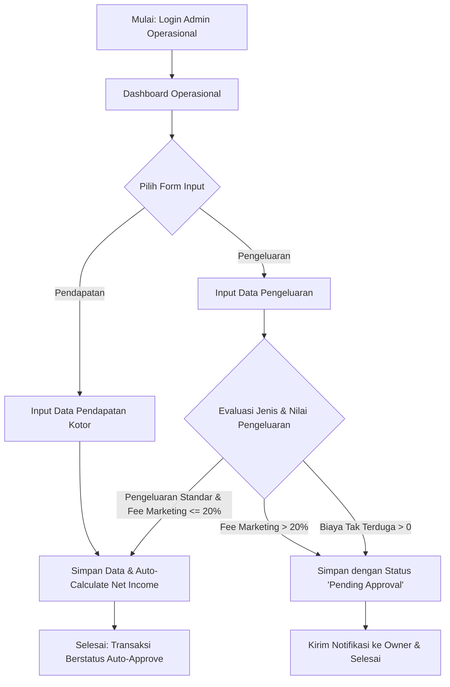
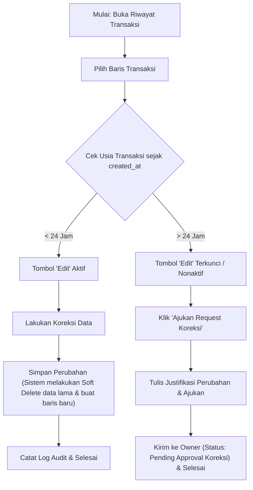
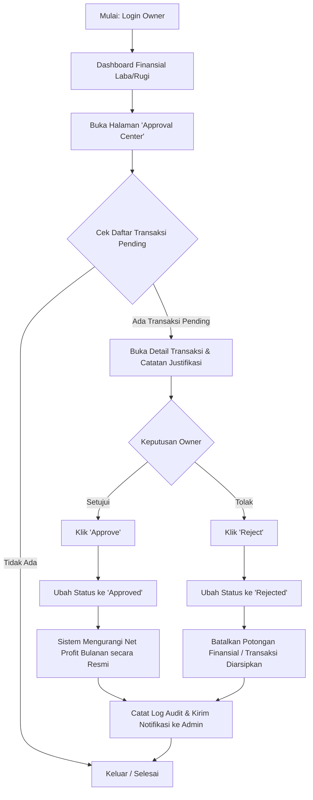
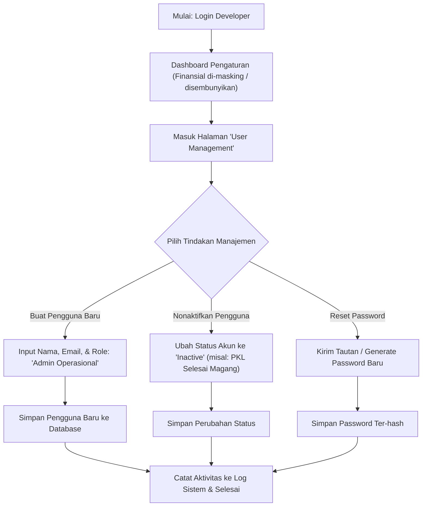

# Alur Pengguna & Diagram Alur (User Flow & Flowchart) - J&J Sentral
**Kode Dokumen:** UFD-JNJ-SENTRAL-02  
**Versi:** 1.0.0  
**Tanggal:** 27 Juli 2026  
**Status:** Siap Ditinjau  
**Target Platform:** Web-Based (Laravel 11.x)  
**Pembuat:** UX Researcher & Lead System Analyst  

---

## 1. Pendahuluan

Dokumen ini mendefinisikan seluruh alur interaksi pengguna (*User Flow*) dan representasi visual berupa diagram alur (*Flowchart*) untuk aplikasi internal **J&J Sentral**. Pemetaan alur ini disusun untuk memastikan bahwa pengembang sistem memiliki pemahaman yang sama mengenai batasan logika bisnis, interaksi antarmuka pengguna (UX), serta alur kerja persetujuan finansial dan operasional.

Sistem ini memfasilitasi tiga kelompok peran utama:
1.  **Admin Operasional** (fokus pada entri data harian dan revisi terbatas).
2.  **Owner** (fokus pada tinjauan performa finansial dan persetujuan transaksi).
3.  **Admin Website / Developer** (fokus pada manajemen pengguna dan sistem keamanan).

---

## 2. Alur Kerja Admin Operasional (Data Entry & Harian)

Admin Operasional bertanggung jawab atas pencatatan aktivitas harian. Alur kerja mereka terbagi menjadi dua proses utama: **Proses Input Transaksi** dan **Proses Revisi Transaksi**.

### 2.1 Alur Input Transaksi (Form Pendapatan & Pengeluaran)

Pada alur ini, Admin Operasional melakukan input data finansial proyek. Logika validasi sistem akan secara otomatis menentukan apakah pengeluaran tersebut disetujui secara otomatis (*Auto-Approve*) atau memerlukan tinjauan lebih lanjut (*Pending Approval*).

#### Penjelasan Naratif Input Transaksi:
1.  **Otentikasi:** Pengguna masuk dengan kredensial *Admin Operasional*.
2.  **Pemilihan Modul:** Pada dashboard, pengguna memilih untuk menginput **Pendapatan** atau **Pengeluaran**.
3.  **Kasus Pendapatan:** Input pendapatan kotor langsung disimpan secara otomatis dan sistem melakukan perhitungan `net_income`.
4.  **Kasus Pengeluaran:** Sistem melakukan pengecekan bersyarat:
    *   Jika jenis pengeluaran adalah pengeluaran standar (seperti upah harian teknisi lapangan, bensin, iklan) ATAU persentase *Fee Marketing* bernilai $\le 20\%$, data disimpan dengan status `Auto-Approve`.
    *   Jika transaksi menyertakan *Fee Marketing* $> 20\%$ (misalnya 30% atau 40%) ATAU terdapat nilai pada *Biaya Tak Terduga*, transaksi akan disimpan dalam database dengan status `Pending Approval`.

---

### 2.2 Alur Revisi & Batas Waktu 24 Jam

Aplikasi melarang keras penghapusan data secara permanen. Admin Operasional dapat melakukan koreksi data secara langsung hanya jika batas waktu pengerjaan tidak melebihi 24 jam dari waktu pembuatan data awal.

#### Penjelasan Naratif Revisi Transaksi:
1.  **Pemeriksaan Waktu:** Ketika Admin Operasional memuat tabel riwayat transaksi, sistem menghitung selisih waktu antara waktu server saat ini dengan kolom `created_at`.
2.  **Rentang Waktu Valid (< 24 Jam):** Pengguna dapat mengklik tombol "Edit" dan menyimpan perubahan. Di latar belakang, sistem melakukan *Soft Delete* pada rekaman lama dan memasukkan rekaman baru untuk meminimalkan redundansi riwayat langsung.
3.  **Rentang Waktu Kedaluwarsa (> 24 Jam):** Tombol edit dinonaktifkan. Pengguna harus mengklik "Ajukan Request Koreksi", mengisi formulir berisi perbaikan data dan alasan koreksi, lalu mengirimkannya kepada *Owner*.

---

## 3. Alur Kerja Owner (Eksekutif & Pengambil Keputusan)

Owner berfokus pada visualisasi performa finansial Rooterin secara keseluruhan dan melakukan *review* terhadap transaksi-transaksi yang tertunda (*pending approval*).

#### Penjelasan Naratif Alur Owner:
1.  **Akses Dashboard:** Setelah login, *Owner* langsung disajikan grafik visual laba/rugi bersih perusahaan.
2.  **Pusat Persetujuan:** Owner menavigasi ke menu **Approval Center** untuk melihat transaksi pending (termasuk biaya tak terduga, fee marketing tinggi, dan *Request Koreksi* data lewat 24 jam).
3.  **Tindakan Persetujuan:**
    *   **Approve:** Status transaksi diubah menjadi `Approved`. Nilai pengeluaran secara resmi diakui dan memotong pendapatan bersih.
    *   **Reject:** Status transaksi diubah menjadi `Rejected`. Transaksi diarsipkan dan tidak dihitung ke dalam kalkulasi keuangan.

---

## 4. Alur Kerja Admin Website / Developer (Teknis)

Admin Website atau Developer memelihara sistem dan mengelola akun pengguna, tanpa memiliki otorisasi visual atau logikal terhadap nilai finansial rahasia perusahaan.

#### Penjelasan Naratif Alur Admin Website:
1.  **Restriksi Visual:** Begitu *Developer* login, halaman beranda mereka bebas dari komponen widget grafik laba bersih atau data rupiah. Nilai sensitif dimasking menjadi `***` melalui implementasi *middleware*.
2.  **Manajemen Pengguna:** Developer memiliki akses penuh untuk melakukan operasi CRUD terhadap akun *Admin Operasional* (misalnya menonaktifkan akun anak PKL yang telah selesai masa magangnya).
3.  **Pencatatan Log:** Setiap tindakan manajemen akun secara otomatis direkam ke dalam tabel log audit sistem demi keamanan internal.
